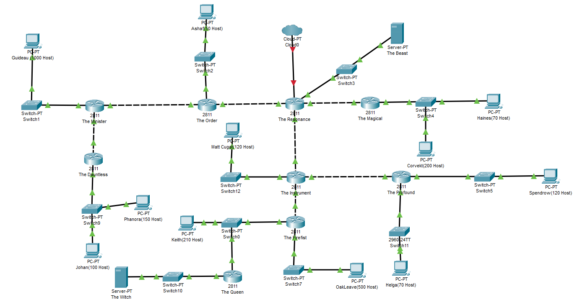
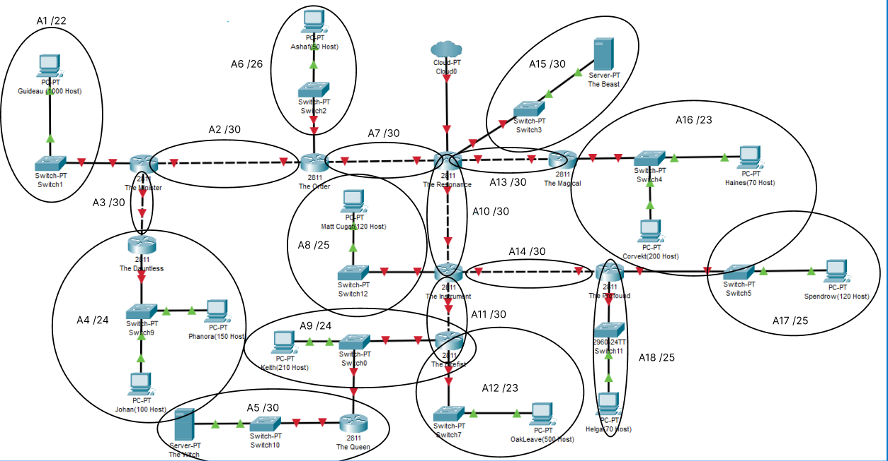

# Jarkom - Modul - 4 - D12 - 2022
  | Anggota | NRP | Bagian yang Dikerjakan |
  | ------- | --- | ---------------------- |
  | Hafizh Mufid Darussalam        | 5025201093 | |
  | Januar Evan Zuriel Banjarnahor | 5025201210 | Cisco Packet Tracer VLSM|
  | Alexander 			               | 5025201247 | GNS 3 CIDR |
  
# Cisco Packet Tracer
1. Membuat Topologi sesuai Soal

2. Membuat Subnetting dengan teknik VLSM

3. Membuat pembagian ip dari Subnetting tersebut 
|Subnet|	|Jumlah IP|	|Netmask|
|-----| |-----| |----|
|A1|	|1000|	|/22|
A2	2	/30
A3	2	/30
A4	250	/24
A5	2	/30
A6	50	/26
A7	2	/30
A8	120	/25
A9	210	/24
A10	2	/30
A11	2	/30
A12	500	/23
A13	2	/30
A14	2	/30
A15	2	/30
A16	270	/23
A17	120	/25
A18	70	/25
Total	2608	/20
