# Jarkom - Modul - 4 - D12 - 2022
  | Anggota | NRP | Bagian yang Dikerjakan |
  | ------- | --- | ---------------------- |
  | Hafizh Mufid Darussalam        | 5025201093 | |
  | Januar Evan Zuriel Banjarnahor | 5025201210 | Cisco Packet Tracer VLSM|
  | Alexander 			               | 5025201247 | GNS 3 CIDR |
  
# Cisco Packet Tracer
1. Membuat Topologi sesuai Soal


2. Membuat Subnetting dengan teknik VLSM


3. Membuat pembagian ip dari Subnetting tersebut

  | Subnet | Jumlah IP | Netmask |
  | ------ | --------- | ------- |
  |   A1   |   1000    |   /22   |
  | A2 | 2 |	/30 |
  | A3 | 2 |	/30 |
  |A4	 |250	|/24|
  |A5|	2|	/30|
  |A6|	50|	/26|
  |A7	|2|	/30|
  |A8|	120	|/25|
  |A9|	210	|/24|
  |A10|	2|	/30|
  |A11|	2	|/30|
  |A12|	500|	/23|
  |A13|	2	|/30|
  |A14|	2	|/30|
  |A15|	2	|/30|
  |A16|	270|	/23|
  |A17|	120|	/25|
  |A18|	70|	/25|
  |Total|	2608|	/20|
 
  Tree
  
  
  Pembagian IP
  
  |Kode|	Length|	Host|	Host Akhir (Digabung)|	Netmask|	Network ID|	IP Host Minimal|	IP Host Maximal|	IP Broadcast ID|
  |----|--------|-----|----------------------|---------|------------|----------------|-----------------|-----------------|
|A1|	/22|	1000|	1001|	255.255.252.0|	10.21.0.0/22|	10.21.0.1|	10.21.3.254|	10.21.3.255|
|A12|	/23|	500|	501|	255.255.254.0|	10.21.4.0/23|	10.21.4.1|	10.21.5.254|	10.21.5.255|
|A16|	/23|	270|	271|	255.255.254.0|	10.21.6.0/23|	10.21.6.1|	10.21.7.254|	10.21.7.255|
|A4|	/24|	250|	251|	255.255.255.0|	10.21.8.0/24|	10.21.8.1|	10.21.8.254|	10.21.8.255|
|A9|	/24|	210|	212|	255.255.255.0|	10.21.9.0/24|	10.21.9.1|	10.21.9.254|	10.21.9.255|
|A17|	/25|	120|	121|	255.255.255.128|	10.21.10.0/25|	10.21.10.1|	10.21.10.126|	10.21.10.127|
|A8|	/25|	120|	121|	255.255.255.128|	10.21.10.128/25|	10.21.10.129|	10.21.10.254|	10.21.10.255|
|A18|	/25|	70|	71|	255.255.255.128|	10.21.11.0/25|	10.21.11.1|	10.21.11.126|	10.21.11.127|
|A6|	/26|	50|	51|	255.255.255.192|	10.21.11.128/26|	10.21.11.129|	10.21.11.190|	10.21.11.191|
|A2|	/30|	2|	2|	255.255.255.252|	10.21.11.192/30|	10.21.11.193|	10.21.11.194|	10.21.11.195|
|A3|	/30|	2|	2|	255.255.255.252|	10.21.11.196/30|	10.21.11.197|	10.21.11.198|	10.21.11.199|
|A5|	/30|	2|	2|	255.255.255.252|	10.21.11.200/30|	10.21.11.201|	10.21.11.202|	10.21.11.203|
|A7|	/30|	2|	2|	255.255.255.252|	10.21.11.204/30|	10.21.11.205|	10.21.11.206|	10.21.11.207|
|A10|	/30|	2|	2|	255.255.255.252|	10.21.11.208/30|	10.21.11.209|	10.21.11.210|	10.21.11.211|
|A11|	/30|	2|	2|	255.255.255.252|	10.21.11.212/30|	10.21.11.213|	10.21.11.214|	10.21.11.215|
|A13|	/30|	2|	2|	255.255.255.252|	10.21.11.216/30|	10.21.11.217|	10.21.11.218|	10.21.11.219|
|A14|	/30|	2|	2|	255.255.255.252|	10.21.11.220/30|	10.21.11.221|	10.21.11.222|	10.21.11.223|
|A15|	/30|	2|	2|	255.255.255.252|	10.21.11.224/30|	10.21.11.225|	10.21.11.226|	10.21.11.227|
|Total|		2608|	2618|

3. Masukkan IP berdasarkan subnetting yang sudah dibuat di dalam Packet Tracer
  - Router The Minister

  
  
  - Router The Order
 
  
  
  - Router The Resonance
 
  
  
  
  
  - Router The Magical
 
  
  
  - Router The Dauntless
 
  
  
  - Router The Instrument
 
  
  
  - Router The Profound
 
  
  
  - Router The Firefist
 
  
  
  - Router The Queen
 
  
  
  - Client Guideau

  
  
  - Client Ashaf

  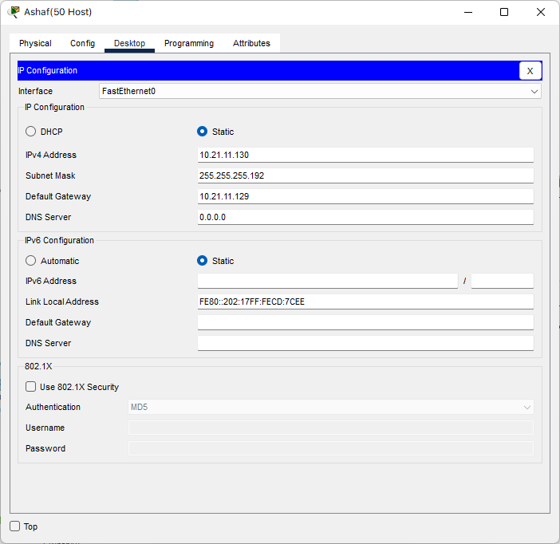
  
  - Server The Beast

  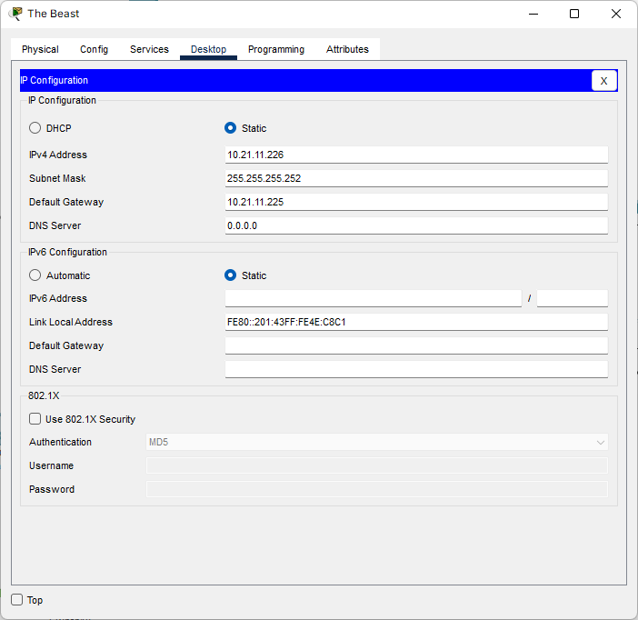
    
  - Client Matt Cugat

  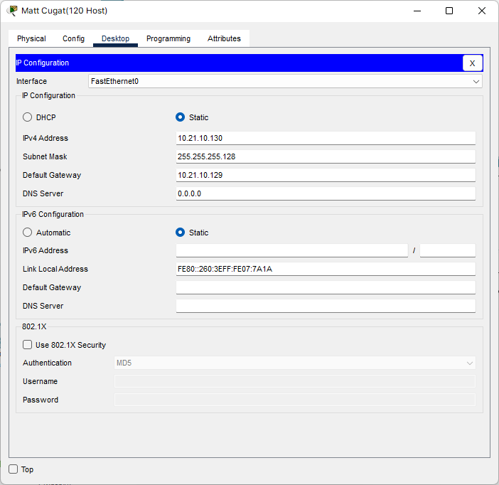
    
  - Server Corvekt

  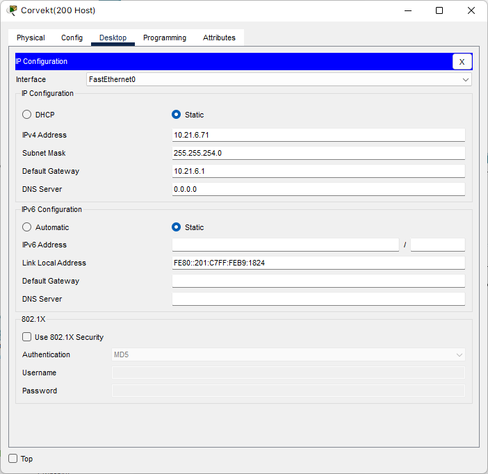
    
  - Client Spendrow

  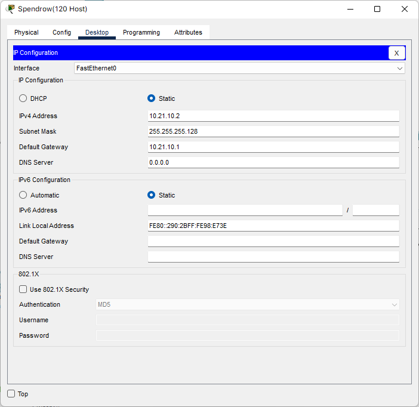
      
  - Client Phanora

  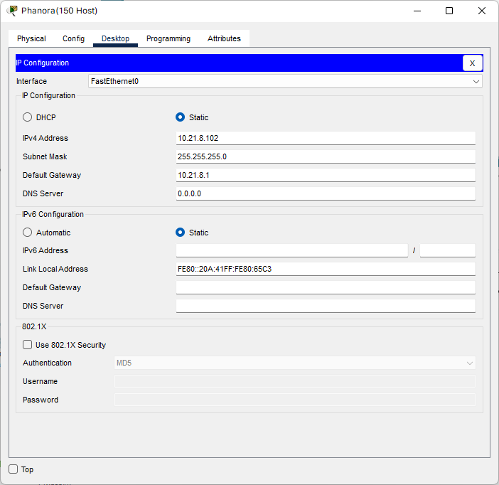
      
  - Client Johan

  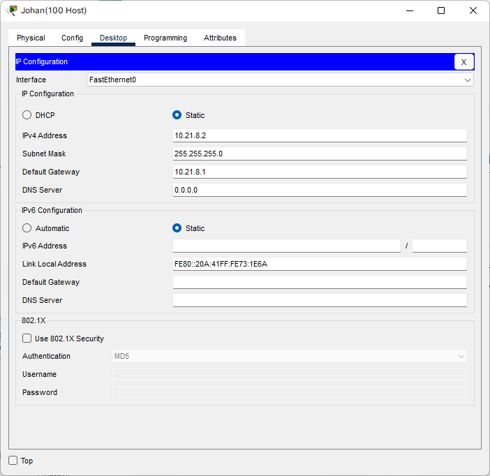
      
  - Client Keith

  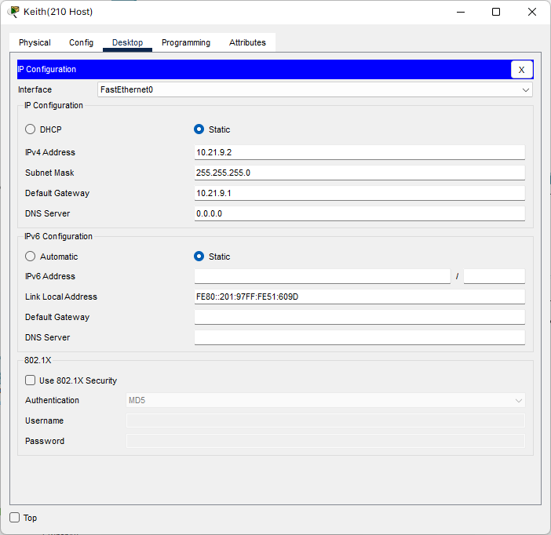
      
  - Client Oakleave

  
      
  - Client Helga

  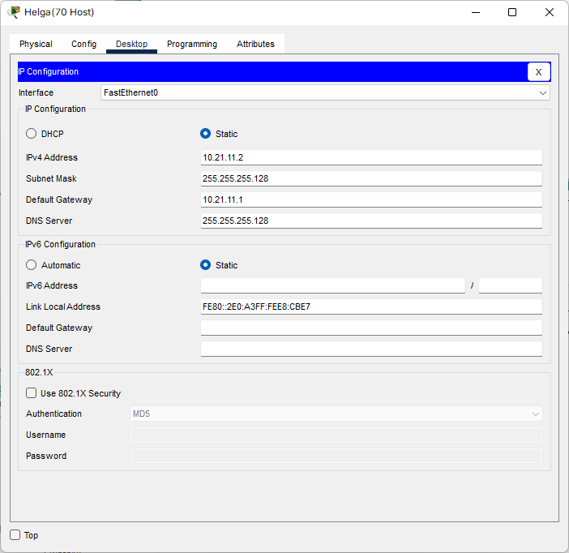
      
  - Server The Witch

  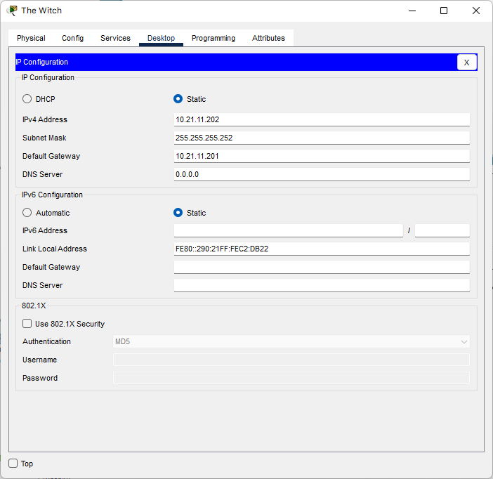
  

4. Test dengan ping (test setiap client ke server)


# GNS3 - CIDR
1. Mencari dan mengelompokkan tiap subnet

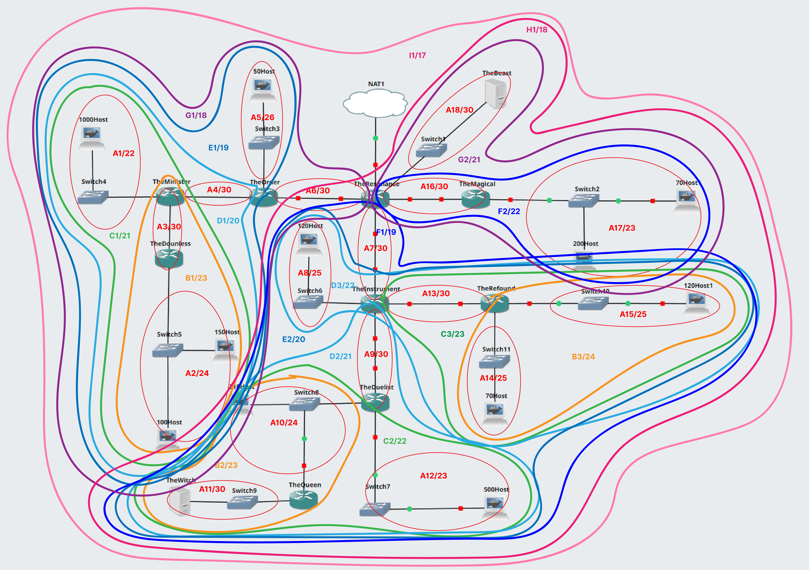

2. Menentukan IP untuk tiap subnet

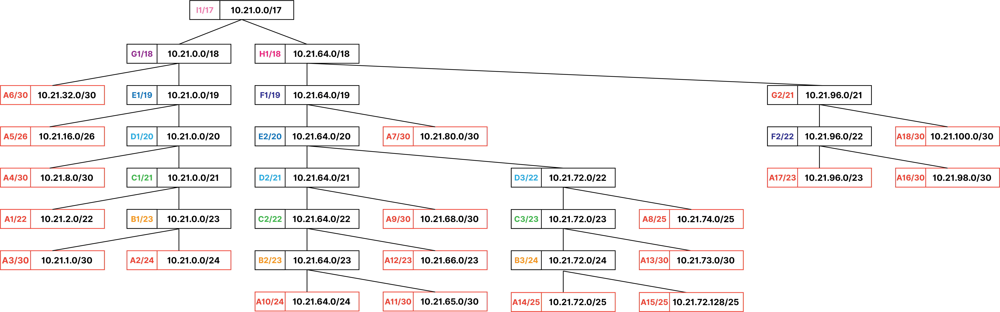

3. Mencari IP tiap node

| Subnet | Node                  | IP           | Subnet Mask     | Length |
| ------ | --------------------- | ------------ | --------------- | ------ |
| A1     | The Minister (eth1)   | 10.21.2.1    | 255.255.252.0   | /22    |
| A1     | Guideau               | 10.21.2.2    | 255.255.252.0   | /22    |
| A2     | The Dauntless (eth1)  | 10.21.0.1    | 255.255.255.0   | /24    |
| A2     | Phanora               | 10.21.0.2    | 255.255.255.0   | /24    |
| A2     | Johan                 | 10.21.0.3    | 255.255.255.0   | /24    |
| A3     | The Minister (eth2)   | 10.21.1.1    | 255.255.255.252 | /30    |
| A3     | The Dauntless (eth0)  | 10.21.1.2    | 255.255.255.252 | /30    |
| A4     | The Minister (eth0)   | 10.21.8.1    | 255.255.255.252 | /30    |
| A4     | The Order (eth2)      | 10.21.8.2    | 255.255.255.252 | /30    |
| A5     | The Order (eth1)      | 10.21.16.1   | 255.255.255.192 | /26    |
| A5     | Ashaf                 | 10.21.16.2   | 255.255.255.192 | /26    |
| A6     | The Order (eth0)      | 10.21.32.1   | 255.255.255.252 | /30    |
| A6     | The Resonance (eth2)  | 10.21.32.2   | 255.255.255.252 | /30    |
| A7     | The Resonance (eth3)  | 10.21.80.1   | 255.255.255.252 | /30    |
| A7     | The Instrument (eth0) | 10.21.80.2   | 255.255.255.252 | /30    |
| A8     | The Instrument (eth1) | 10.21.74.1   | 255.255.255.128 | /25    |
| A8     | Matt Cugat            | 10.21.74.2   | 255.255.255.128 | /25    |
| A9     | The Instrument (eth3) | 10.21.68.1   | 255.255.255.252 | /30    |
| A9     | The Firefist (eth0)   | 10.21.68.2   | 255.255.255.252 | /30    |
| A10    | The Firefist(eth1)    | 10.21.64.1   | 255.255.255.0   | /24    |
| A10    | The Queen (eth0)      | 10.21.64.2   | 255.255.255.0   | /24    |
| A10    | Keith                 | 10.21.64.3   | 255.255.255.0   | /24    |
| A11    | The Queen (eth1)      | 10.21.65.1   | 255.255.255.252 | /30    |
| A11    | The Witch             | 10.21.65.2   | 255.255.255.252 | /30    |
| A12    | The Firefist (eth2)   | 10.21.66.1   | 255.255.254.0   | /23    |
| A12    | Oakleave              | 10.21.66.2   | 255.255.254.0   | /23    |
| A13    | The instrument (eth2) | 10.21.73.1   | 255.255.255.252 | /30    |
| A13    | The Profound (eth0)   | 10.21.73.2   | 255.255.255.252 | /30    |
| A14    | The Profound (eth2)   | 10.21.72.1   | 255.255.255.128 | /25    |
| A14    | Helga                 | 10.21.72.2   | 255.255.255.128 | /25    |
| A15    | The Profound (eth1)   | 10.21.72.129 | 255.255.255.128 | /25    |
| A15    | Spendrow              | 10.21.72.130 | 255.255.255.128 | /25    |
| A16    | The Resonance (eth4)  | 10.21.98.1   | 255.255.255.252 | /30    |
| A16    | The Magical (eth0)    | 10.21.98.2   | 255.255.255.252 | /30    |
| A17    | The Magical (eth1)    | 10.21.96.1   | 255.255.254.0   | /23    |
| A17    | Haines                | 10.21.96.2   | 255.255.254.0   | /23    |
| A17    | Corvekt               | 10.21.96.3   | 255.255.254.0   | /23    |
| A18    | The Resonance (eth1)  | 10.21.100.1  | 255.255.255.252 | /30    |
| A18    | The Beast             | 10.21.100.2  | 255.255.255.252 | /30    |

4. Melakukan konfigurasi untuk tiap node

- The Resonance

```
auto eth0
iface eth0 inet dhcp

auto eth1
iface eth1 inet static
address 10.21.100.1
netmask 255.255.252.0

auto eth2
iface eth2 inet static
address 10.21.32.2
netmask 255.255.255.252

auto eth3
iface eth3 inet static
address 10.21.80.1
netmask 255.255.255.252

auto eth4
iface eth4 inet static
address 10.21.98.1
netmask 255.255.255.252
```

- The Magical

```
auto eth0
iface eth0 inet static
address 10.21.98.2
netmask 255.255.255.252
gateway 10.21.98.1

auto eth1
iface eth1 inet static
address 10.21.96.1
netmask 255.255.252.0
```
- Haines

```
auto eth0
iface eth0 inet static
address 10.21.96.2
netmask 255.255.254.0
gateway 10.21.96.1
```

- Corvekt

```
auto eth0
iface eth0 inet static
address 10.21.96.3
netmask 255.255.254.0
gateway 10.21.96.1
```

- The Instrument

```
auto eth0
iface eth0 inet static
address 10.21.80.2
netmask 255.255.255.252
gateway 10.21.80.1

auto eth1
iface eth1 inet static
address 10.21.74.1
netmask 255.255.255.128

auto eth2
iface eth2 inet static
address 10.21.73.1
netmask 255.255.255.252

auto eth3
iface eth3 inet static
address 10.21.68.1
netmask 255.255.255.252
```

- Matt Cugat

```
auto eth0
iface eth0 inet static
address 10.21.74.2
netmask 255.255.255.128
gateway 10.21.74.1
```

- The Profound

```
auto eth0
iface eth0 inet static
address 10.21.73.2
netmask 255.255.255.252
gateway 10.21.73.1

auto eth1
iface eth1 inet static
address 10.21.72.129
netmask 255.255.255.128

auto eth2
iface eth2 inet static
address 10.21.72.1
netmask 255.255.255.128
```

- Spendrow

```
auto eth0
iface eth0 inet static
address 10.21.72.130
netmask 255.255.255.128
gateway 10.21.72.129
```

- Helga

```
auto eth0
iface eth0 inet static
address 10.21.72.2
netmask 255.255.255.128
gateway 10.21.72.1
```

- The Firefist

```
auto eth0
iface eth0 inet static
address 10.21.68.2
netmask 255.255.255.252
gateway 10.21.68.1

auto eth1
iface eth1 inet static
address 10.21.64.1
netmask 255.255.255.0

auto eth2
iface eth2 inet static
address 10.21.66.1
netmask 255.255.254.0
```

- Oakleve

```
auto eth0
iface eth0 inet static
address 10.21.66.2
netmask 255.255.254.0
gateway 10.21.66.1
```

- Keith

```
auto eth0
iface eth0 inet static
address 10.21.64.3
netmask 255.255.255.0
gateway 10.21.64.1
```

- The Queen

```
auto eth0
iface eth0 inet static
address 10.21.64.2
netmask 255.255.255.0
gateway 10.21.64.1

auto eth1
iface eth1 inet static
address 10.21.65.1
netmask 255.255.255.252
```

- The Witch

```
auto eth0
iface eth0 inet static
address 10.21.65.2
netmask 255.255.255.252
gateway 10.21.65.1
```

- The Order

```
auto eth0
iface eth0 inet static
address 10.21.32.1
netmask 255.255.255.252
gateway 10.21.32.2

auto eth1
iface eth1 inet static
address 10.21.16.1
netmask 255.255.255.192

auto eth2
iface eth2 inet static
address 10.21.8.2
netmask 255.255.255.252
```

- Ashaf

```
auto eth0
iface eth0 inet static
address 10.21.16.2
netmask 255.255.255.192
gateway 10.21.16.1
```

- The Minister

```
auto eth0
iface eth0 inet static
address 10.21.8.1
netmask 255.255.255.252
gateway 10.21.8.2

auto eth1
iface eth1 inet static
address 10.21.2.1
netmask 255.255.252.0

auto eth2
iface eth2 inet static
address 10.21.1.1
netmask 255.255.255.252
```

- Guideau

```
auto eth0
iface eth0 inet static
address 10.21.2.2
netmask 255.255.252.0
gateway 10.21.2.1
```

- The Dauntless

```
auto eth0
iface eth0 inet static
address 10.21.1.2
netmask 255.255.255.252
gateway 10.21.1.1

auto eth1
iface eth1 inet static
address 10.21.0.1
netmask 255.255.255.0
```

- Phanora

```
auto eth0
iface eth0 inet static
address 10.21.0.2
netmask 255.255.255.0
gateway 10.21.0.1
```

- Johan

```
auto eth0
iface eth0 inet static
address 10.21.0.3
netmask 255.255.255.0
gateway 10.21.0.1
```

5. Melakukan Routing 

- The Dauntless

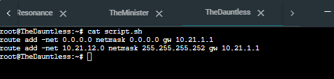

- The Firefist

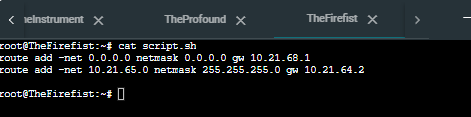

- The Instrument

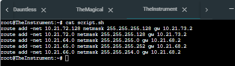

- The Minister

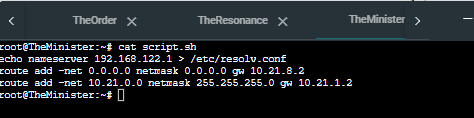

- The Order

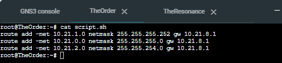

- The Queen

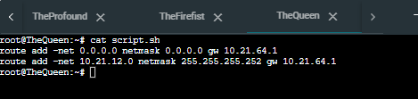

- The Resonance
 
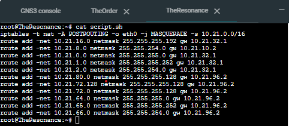


### Revisi Ping CIDR

- Guideau - Firefist
 
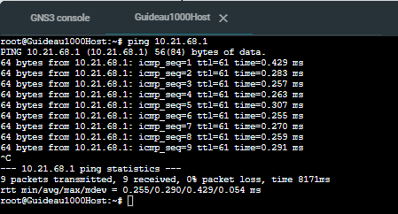

- Matt Cugat - Corvekt 

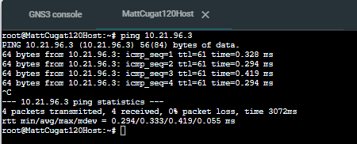

- Haines - Keith
 
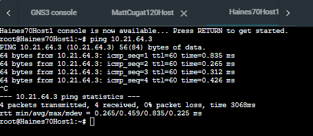

- Corvekt - Minister

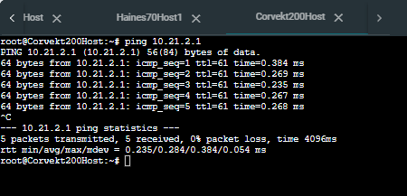

- Guideau - Helga
 
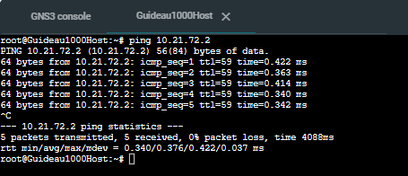
