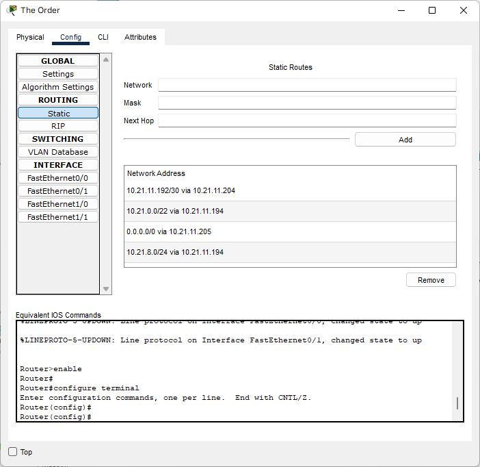

# Jarkom - Modul - 4 - D12 - 2022
  | Anggota | NRP | Bagian yang Dikerjakan |
  | ------- | --- | ---------------------- |
  | Hafizh Mufid Darussalam        | 5025201093 | |
  | Januar Evan Zuriel Banjarnahor | 5025201210 | Cisco Packet Tracer VLSM|
  | Alexander 			               | 5025201247 | GNS 3 CIDR |
  
# Cisco Packet Tracer
1. Membuat Topologi sesuai Soal

2. Membuat Subnetting dengan teknik VLSM

3. Membuat pembagian ip dari Subnetting tersebut

  | Subnet | Jumlah IP | Netmask |
  | ------ | --------- | ------- |
  |   A1   |   1000    |   /22   |
  | A2 | 2 |	/30 |
  | A3 | 2 |	/30 |
  |A4	 |250	|/24|
  |A5|	2|	/30|
  |A6|	50|	/26|
  |A7	|2|	/30|
  |A8|	120	|/25|
  |A9|	210	|/24|
  |A10|	2|	/30|
  |A11|	2	|/30|
  |A12|	500|	/23|
  |A13|	2	|/30|
  |A14|	2	|/30|
  |A15|	2	|/30|
  |A16|	270|	/23|
  |A17|	120|	/25|
  |A18|	70|	/25|
  |Total|	2608|	/20|
 
  Tree
  
  
  Pembagian IP
  
  |Kode|	Length|	Host|	Host Akhir (Digabung)|	Netmask|	Network ID|	IP Host Minimal|	IP Host Maximal|	IP Broadcast ID|
  |----|--------|-----|----------------------|---------|------------|----------------|-----------------|-----------------|
|A1|	/22|	1000|	1001|	255.255.252.0|	10.21.0.0/22|	10.21.0.1|	10.21.3.254|	10.21.3.255|
|A12|	/23|	500|	501|	255.255.254.0|	10.21.4.0/23|	10.21.4.1|	10.21.5.254|	10.21.5.255|
|A16|	/23|	270|	271|	255.255.254.0|	10.21.6.0/23|	10.21.6.1|	10.21.7.254|	10.21.7.255|
|A4|	/24|	250|	251|	255.255.255.0|	10.21.8.0/24|	10.21.8.1|	10.21.8.254|	10.21.8.255|
|A9|	/24|	210|	212|	255.255.255.0|	10.21.9.0/24|	10.21.9.1|	10.21.9.254|	10.21.9.255|
|A17|	/25|	120|	121|	255.255.255.128|	10.21.10.0/25|	10.21.10.1|	10.21.10.126|	10.21.10.127|
|A8|	/25|	120|	121|	255.255.255.128|	10.21.10.128/25|	10.21.10.129|	10.21.10.254|	10.21.10.255|
|A18|	/25|	70|	71|	255.255.255.128|	10.21.11.0/25|	10.21.11.1|	10.21.11.126|	10.21.11.127|
|A6|	/26|	50|	51|	255.255.255.192|	10.21.11.128/26|	10.21.11.129|	10.21.11.190|	10.21.11.191|
|A2|	/30|	2|	2|	255.255.255.252|	10.21.11.192/30|	10.21.11.193|	10.21.11.194|	10.21.11.195|
|A3|	/30|	2|	2|	255.255.255.252|	10.21.11.196/30|	10.21.11.197|	10.21.11.198|	10.21.11.199|
|A5|	/30|	2|	2|	255.255.255.252|	10.21.11.200/30|	10.21.11.201|	10.21.11.202|	10.21.11.203|
|A7|	/30|	2|	2|	255.255.255.252|	10.21.11.204/30|	10.21.11.205|	10.21.11.206|	10.21.11.207|
|A10|	/30|	2|	2|	255.255.255.252|	10.21.11.208/30|	10.21.11.209|	10.21.11.210|	10.21.11.211|
|A11|	/30|	2|	2|	255.255.255.252|	10.21.11.212/30|	10.21.11.213|	10.21.11.214|	10.21.11.215|
|A13|	/30|	2|	2|	255.255.255.252|	10.21.11.216/30|	10.21.11.217|	10.21.11.218|	10.21.11.219|
|A14|	/30|	2|	2|	255.255.255.252|	10.21.11.220/30|	10.21.11.221|	10.21.11.222|	10.21.11.223|
|A15|	/30|	2|	2|	255.255.255.252|	10.21.11.224/30|	10.21.11.225|	10.21.11.226|	10.21.11.227|
|Total|		2608|	2618|

3. Masukkan IP berdasarkan subnetting yang sudah dibuat di dalam Packet Tracer
  - Router The Minister
  
  
  - Router The Order
  
  
  - Router The Resonance
  
  
  
  - Router The Magical
  
  
  - Router The Dauntless
  
  
  - Router The Instrument
  
  
  - Router The Profound
  
  
  - Router The Firefist
  
  
  - Router The Queen
  
  

4. Test dengan ping (test setiap client ke server)
